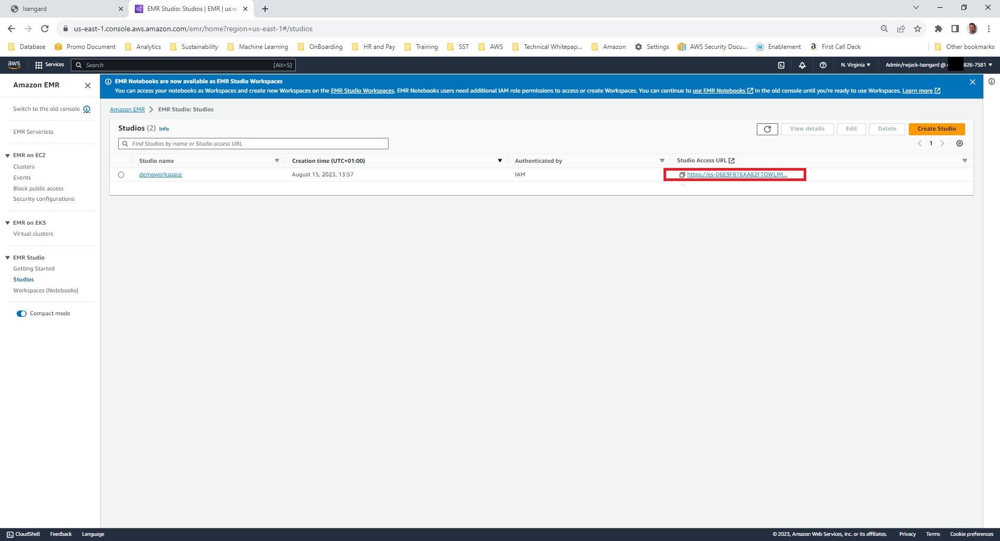

<h2> Quick start guide for running PySpark code using AWS EMR Studio </h2>

In this demonstration we will provide a quick start guide to set up the relevant resources to start using EMR Studio.  

Since AWS announced EMR Studio, it has been really easy to benefit from the processing power of EMR through EMR Studio.  EMR Studio is an integrated development environment (IDE) that makes it easy for data scientists and data engineers to develop, visualize, and debug data engineering and data science applications written in R, Python, Scala, and PySpark.
In this demo we will;

1.	Create a bucket and upload a file
2.	Create an EMR Studio Workspace
3.	Within EMR Studio we will create an EMR Cluster
4.	Ingest the data into a Spark DataFrame using PySpark

Navigate to S3 (you can use the search feature in the AWS Console)
Select **Create Bucket**. Create a bucket with default settings.  

Click on the bucket and select **Upload**.

For this demo we are using a publicly available dataset of New York yellow taxi journeys.  Click through the default upload options.  

Navigate to EMR (using the search option in the console) Select **Studio** and **Create Studio**

When setting up your EMR studio, select a VPC and subnet you have access to.  You can update the workspace bucket to the bucket that you created earlier in this demo.  Ensure the AWS IAM service role you select has S3 access to the bucket. Select **Create Studio**

Once completed EMR Studio will provide a link on screen that will direct you to your EMR Notebook

This URL will open the Studio notebook.  Within the studio notebook you have the option to run code using multiple different Kernels.  

Prior to running any code, we need to provide the studio notebook with compute to run the code.  This will be performed by creating an EMR cluster.  We can do this in EMR Studio window.  

On the left handside of the notebook, select the cluster option.  Under advanced configurations select **Create cluster**.  

Add a cluster name of your choosing.  Choose the latest version of EMR.  Choose the number of nodes (minimal of 2) and the EC2 instance type (M4.2xlarge).  Add your S3 bucket to the logging bucket option.  Select **Create cluster**. Creating the cluster will take between 5-10 minutes.  

Once the cluster has been created, use the drop down EMR Cluster on EC2 and select the cluster you have just created.  Then select **Attach**.  This will attach the notebook to this cluster.  

Select the PySpark runtime.    

Insert the following code into the notebook.  This statement will ingest data from your S3 bucket (remembering to change the bucket name) into a Dataframe

<code>df6 = spark.read.options(header='True', inferSchema='True', delimiter=',') \
  .csv("s3://[insertbucketname]/yellow_tripdata_2020-06-WithHeaders.csv")</code>

Let’s perform a quick count to see if we have successfully ingested data into our dataframe.

<code>df6.count()</code>

